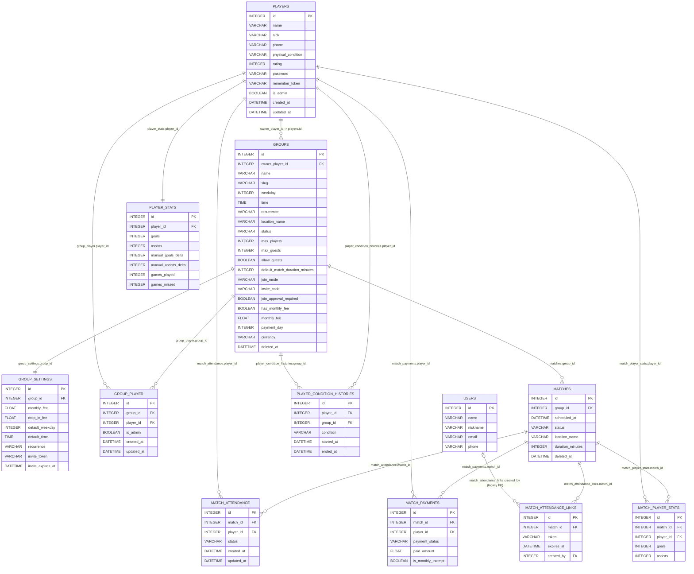

# Database ERD (Current Schema)

This diagram focuses on the domain tables used by the product flows (players, groups, matches, presence, payments, stats), plus legacy references that still exist in schema.

## Foreign Keys (explicit)

- `groups.owner_player_id -> players.id`
- `group_settings.group_id -> groups.id`
- `group_player.group_id -> groups.id`
- `group_player.player_id -> players.id`
- `matches.group_id -> groups.id`
- `match_attendance.match_id -> matches.id`
- `match_attendance.player_id -> players.id`
- `match_payments.match_id -> matches.id`
- `match_payments.player_id -> players.id`
- `match_player_stats.match_id -> matches.id`
- `match_player_stats.player_id -> players.id`
- `player_stats.player_id -> players.id`
- `player_condition_histories.player_id -> players.id`
- `player_condition_histories.group_id -> groups.id`
- `match_attendance_links.match_id -> matches.id`
- `match_attendance_links.created_by -> users.id` (legacy relation still present in schema)
