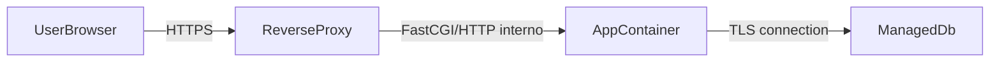

# Arquitetura Alvo na VPS (Web App)

## Topologia

- VPS Linux com Docker Engine + Docker Compose Plugin.
- `reverse-proxy` (Nginx ou Caddy) exposto em `80/443`.
- `app` (Laravel + PHP-FPM + assets buildados).
- Banco **managed** fora da VPS, acessado por TLS.

## Papel de Cada Camada

- `reverse-proxy`:
  - termina TLS;
  - aplica headers de segurança;
  - roteia tráfego para o container de app.
- `app`:
  - executa Laravel;
  - serve Inertia + assets de produção;
  - mantém estado apenas em runtime (sem dados críticos locais).
- `managed-db`:
  - persistência principal;
  - backup e patching gerenciados pelo provedor.

## Rede e Exposição

- Público: apenas `80` e `443`.
- Privado: porta interna da app não deve ser exposta publicamente.
- SSH da VPS restrito por chave, porta padrão com hardening opcional.

## Persistência

- Manter volume apenas para:
  - logs locais (opcional, se não enviar para agregador);
  - `storage/app/public` se houver upload local.
- Não persistir banco local.

## Configuração de Deploy Manual

- Imagens versionadas por tag (`vX.Y.Z` ou `sha-<commit>`).
- Atualização via:
  1. `docker compose pull`
  2. `docker compose up -d`
  3. healthcheck + smoke test
  4. rollback por tag anterior, se necessário

## Segurança Mínima Obrigatória

- TLS com renovação automática.
- Firewall (`ufw` ou equivalente) liberando só SSH, 80 e 443.
- Atualizações de segurança recorrentes no host.
- Usuário não-root para operação.

## Critérios de Aceite da Arquitetura

- Tráfego web atende por HTTPS válido.
- App responde healthcheck em menos de 2s na VPS alvo.
- App conecta no banco managed com TLS sem timeout.
